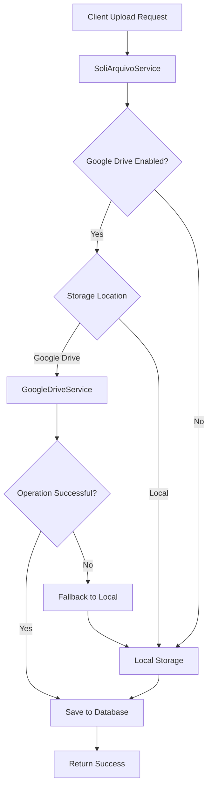

# Google Drive Integration Architecture

## Overview

This document describes the architecture of the Google Drive integration in the CRA Backend system, including the fallback mechanism that ensures file operations continue to work even when Google Drive is not available.

## System Architecture

### Components

1. **GoogleDriveService**: Core service for interacting with Google Drive API
2. **SoliArquivoService**: Main file management service that orchestrates storage decisions
3. **SoliArquivo Entity**: Database entity that tracks file storage location
4. **Configuration Properties**: Application configuration for Google Drive integration

### Data Flow



## Storage Location Management

### SoliArquivo Entity Fields

The [SoliArquivo](src/main/java/br/adv/cra/entity/SoliArquivo.java) entity has been extended to support multiple storage locations:

- `storageLocation`: Indicates where the file is stored ("local" or "google_drive")
- `googleDriveFileId`: Google Drive file ID when stored in Google Drive
- `caminhofisico`: Physical file path when stored locally
- `caminhorelativo`: Relative HTTP path when stored locally

### Storage Decision Logic

The storage location is determined by:

1. Configuration setting `google.drive.oauth.enabled`
2. Client request parameter `storageLocation`
3. Fallback mechanism when Google Drive operations fail

## Error Handling and Fallback Mechanism

### Error Types Handled

1. **Network Errors**: SocketException, ConnectException, etc.
2. **Authentication Errors**: Invalid credentials, expired tokens
3. **Timeout Errors**: Connection timeouts, read timeouts
4. **API Errors**: Google Drive API errors
5. **Unexpected Errors**: Any other unhandled exceptions

### Fallback Process

When a Google Drive operation fails:

1. The error is logged with full details
2. The operation falls back to local storage
3. The SoliArquivo entity is updated to reflect local storage
4. The client receives a success response (transparent fallback)

### Implementation Details

```java
// In SoliArquivoService.java
if (googleDriveEnabled && "google_drive".equals(storageLocation)) {
    try {
        return saveFileToGoogleDrive(file, solicitacao, origem);
    } catch (SocketException e) {
        logger.error("Network error during Google Drive upload: ", e);
        logger.warn("Failed to save file to Google Drive due to network issues. Falling back to local storage.");
        return saveFileLocally(file, solicitacao, origem);
    } catch (RuntimeException e) {
        logger.warn("Failed to save file to Google Drive. Falling back to local storage.", e);
        return saveFileLocally(file, solicitacao, origem);
    } catch (IOException e) {
        logger.warn("Failed to save file to Google Drive due to IO error. Falling back to local storage.", e);
        return saveFileLocally(file, solicitacao, origem);
    } catch (Exception e) {
        logger.warn("Unexpected error during Google Drive upload. Falling back to local storage.", e);
        return saveFileLocally(file, solicitacao, origem);
    }
}
```

## Timeout Management

### HTTP Transport Creation Timeout

To prevent hanging during GoogleNetHttpTransport.newTrustedTransport():

```java
private NetHttpTransport createHttpTransportWithTimeout() throws GeneralSecurityException, IOException {
    ExecutorService executor = Executors.newSingleThreadExecutor();
    try {
        Future<NetHttpTransport> future = executor.submit(() -> {
            try {
                return GoogleNetHttpTransport.newTrustedTransport();
            } catch (Exception e) {
                throw new RuntimeException(e);
            }
        });
        
        // Wait for at most 15 seconds
        return future.get(15, TimeUnit.SECONDS);
    } catch (TimeoutException e) {
        throw new IOException("Timeout while initializing Google Drive service", e);
    }
    // ... other exception handling
}
```

### API Request Timeouts

All Google Drive API requests have configured timeouts:

```java
private HttpRequestInitializer setHttpTimeout(final GoogleCredential credential) {
    return new HttpRequestInitializer() {
        @Override
        public void initialize(HttpRequest httpRequest) throws IOException {
            credential.initialize(httpRequest);
            httpRequest.setConnectTimeout(30000); // 30 seconds
            httpRequest.setReadTimeout(30000);    // 30 seconds
        }
    };
}
```

## Configuration Management

### Application Properties

Key configuration properties in [application.properties](src/main/resources/application.properties):

```properties
# Enable Google Drive OAuth integration
google.drive.oauth.enabled=true

# Google Drive OAuth client credentials
google.drive.oauth.client.id=YOUR_CLIENT_ID
google.drive.oauth.client.secret=YOUR_CLIENT_SECRET

# Google Drive folder ID (optional)
google.drive.folder.id=YOUR_FOLDER_ID

# Service Account Key Path (optional)
google.service.account.key.path=

# Local file storage directory
file.upload-dir=/app/uploads
```

### Environment-Specific Configuration

Different environments can override these settings:

1. **Development**: Use OAuth2 client credentials or service account
2. **Testing**: Disable Google Drive integration to use only local storage
3. **Production**: Use service account with proper security configuration

## Security Considerations

### Credential Storage

1. **Service Account Keys**: Should be stored securely, not in version control
2. **OAuth2 Credentials**: Client ID/Secret are not sensitive but should be managed properly
3. **Access Tokens**: Should never be stored in plain text

### Data Protection

1. **Encryption**: Files are stored as-is (no additional encryption)
2. **Access Control**: File access is controlled through the application
3. **Audit Trail**: All file operations are logged

## Performance Considerations

### Connection Management

1. **HTTP Transport Reuse**: The NetHttpTransport is reused within each operation
2. **Connection Pooling**: Google's HTTP client handles connection pooling
3. **Timeout Configuration**: Prevents resource exhaustion from hanging connections

### Fallback Performance

1. **Local Storage**: Generally faster than cloud storage
2. **Database Operations**: Minimal impact on performance
3. **Error Logging**: Non-blocking logging operations

## Monitoring and Logging

### Log Levels

1. **INFO**: Major operations and decisions
2. **WARN**: Fallback events and non-critical issues
3. **ERROR**: Critical failures and exceptions
4. **DEBUG**: Detailed operational information

### Key Metrics

1. **Fallback Rate**: Percentage of operations that fall back to local storage
2. **Error Types**: Categorization of Google Drive errors
3. **Response Times**: Comparison between Google Drive and local operations

## Testing Strategy

### Unit Tests

1. **GoogleDriveService**: Test timeout handling and error scenarios
2. **SoliArquivoService**: Test storage decision logic and fallback mechanism
3. **Configuration**: Test different configuration scenarios

### Integration Tests

1. **Local Storage**: Verify local file operations work correctly
2. **Google Drive Operations**: Test with valid credentials
3. **Fallback Scenarios**: Test various failure conditions

### Error Simulation

1. **Network Failures**: Simulate SocketException and timeout conditions
2. **Authentication Failures**: Test with invalid credentials
3. **API Errors**: Mock Google Drive API errors

## Future Improvements

### Enhanced Authentication

1. **Complete OAuth2 Flow**: Implement full OAuth2 authentication
2. **Token Management**: Proper access/refresh token handling
3. **User-Level Credentials**: Per-user Google Drive integration

### Advanced Features

1. **Resumable Uploads**: For large file support
2. **Progress Tracking**: For long-running operations
3. **Batch Operations**: For multiple file operations

### Monitoring Enhancements

1. **Metrics Collection**: Collect detailed performance metrics
2. **Health Checks**: Proactive Google Drive connectivity testing
3. **Alerting**: Notification for persistent failures

## Summary

The Google Drive integration architecture provides:

1. **Reliability**: Through comprehensive error handling and fallback mechanisms
2. **Flexibility**: Support for multiple authentication methods and storage locations
3. **Performance**: Optimized timeout management and connection handling
4. **Security**: Proper credential management and access control
5. **Maintainability**: Clear separation of concerns and comprehensive logging

The fallback mechanism ensures that file operations continue to work even when Google Drive is not available, providing a seamless experience for end users.