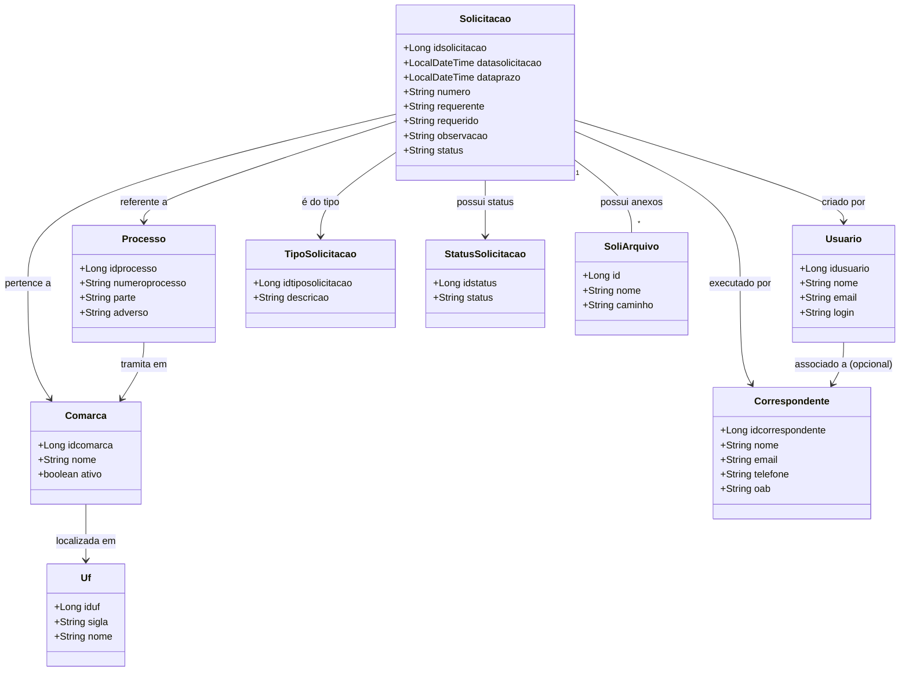
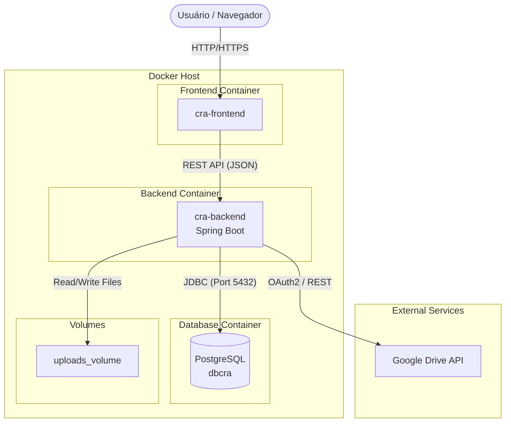
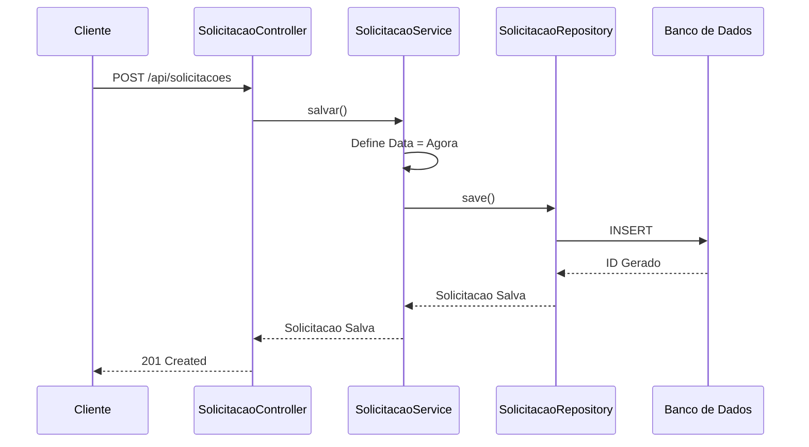
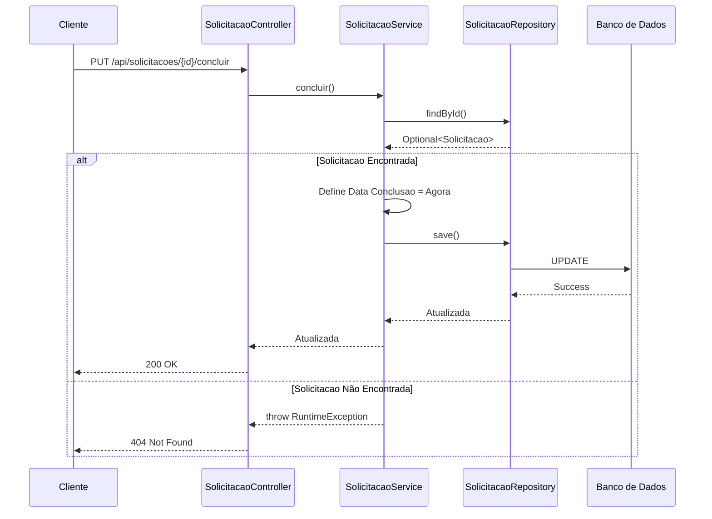
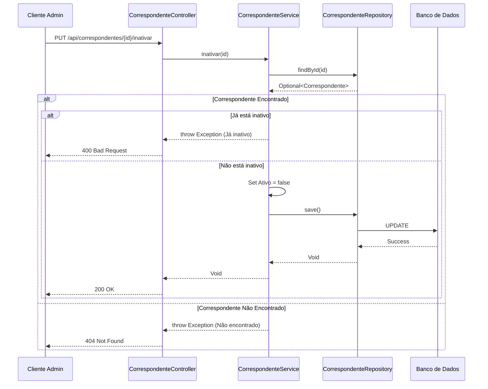

# CRA Backend - API Spring Boot

## 1. Visão Geral do Projeto

### Contexto e Valor do Projeto
O CRA Backend é um sistema baseado em Spring Boot para a aplicação Correspondente Responsável por Atos (CRA). Ele fornece uma API RESTful para gerenciamento de processos jurídicos, usuários e dados relacionados, com suporte para autenticação via tokens JWT.

### Problemas Centrais Resolvidos
- Gerenciamento centralizado de processos jurídicos e solicitações.
- Autenticação de usuário segura e controle de acesso baseado em funções (RBAC).
- Suporte para anexos de arquivos no gerenciamento de solicitações.
- Integração com múltiplos bancos de dados (PostgreSQL, MySQL, H2).

### Recursos do Sistema
- Endpoints de API RESTful para gerenciar usuários, processos, solicitações e entidades jurídicas.
- Autenticação e autorização baseadas em JWT com tokens de atualização (refresh tokens).
- Gerenciamento de anexos de arquivos para solicitações.
- Suporte para múltiplos backends de banco de dados.
- Documentação abrangente da API via Swagger/OpenAPI.
- Configurável para ambientes de desenvolvimento, teste e produção.
- Integração com Google Drive OAuth para armazenamento de arquivos na nuvem.

## 2. Padrão de Arquitetura do Sistema

### Arquitetura Geral
O sistema segue um padrão de **arquitetura em camadas**:
- **Camada de Controller**: Manipula requisições e respostas HTTP.
- **Camada de Service**: Contém a lógica de negócio.
- **Camada de Repository**: Gerencia a persistência de dados.
- **Camada de Entity**: Representa as entidades do banco de dados.
- **Camada de Security**: Gerencia autenticação e autorização usando JWT.

### Decisões Técnicas Principais
- **Spring Boot 3.2.5** para desenvolvimento rápido e capacidades de servidor embutido.
- **Autenticação JWT** para acesso seguro de usuários.
- **Suporte a múltiplos bancos de dados** (PostgreSQL para produção, MySQL como alternativa, H2 para desenvolvimento).
- **Swagger/OpenAPI 3.0** para documentação interativa da API.
- **Implantação baseada em Docker** para conteinerização e portabilidade.
- **Google Drive OAuth 2.0** para armazenamento de arquivos em nuvem.

### Padrões de Arquitetura e Design Utilizados
- **MVC (Model-View-Controller)**: Para manipular requisições e respostas HTTP.
- **Padrão Repository**: Para abstração de acesso a dados.
- **DTO (Data Transfer Object)**: Para transferência de dados entre camadas.
- **Padrão Singleton**: Utilizado em beans gerenciados pelo Spring.
- **Padrão Strategy**: Para configuração dinâmica de estratégias de banco de dados e autenticação.

### Interação entre Componentes
- Controllers recebem requisições HTTP e delegam para os serviços.
- Serviços interagem com repositórios para buscar ou persistir dados.
- Entidades representam registros do banco de dados.
- Componentes de segurança interceptam requisições para autenticação e autorização.
- DTOs são usados para transferir dados entre componentes sem expor entidades.

### Diagramas de Arquitetura

#### Diagrama de Classes
O diagrama a seguir representa as entidades principais do sistema e seus relacionamentos:



#### Diagrama de Implantação (Deployment)
Este diagrama ilustra a arquitetura de implantação do sistema, destacando os containers Docker e integrações externas:



#### Diagramas de Sequência

##### 1. Fluxo de Criação de Solicitação
Este diagrama detalha a interação entre as camadas ao criar uma nova `Solicitacao`:



##### 2. Fluxo de Conclusão de Solicitação
Fluxo para marcar uma `Solicitacao` como concluída:



##### 3. Fluxo de Inativação de Correspondente
Fluxo para inativar um `Correspondente`:



## 3. Informações Técnicas do Sistema

### Stack Tecnológica e Frameworks
- **Java 17+**
- **Spring Boot 3.2.5**
  - Spring Web
  - Spring Data JPA
  - Spring Security
  - Spring Validation
- **JWT Authentication**
- **Databases**:
  - PostgreSQL (production)
  - MySQL (alternative)
  - H2 (development/testing)
- **Lombok** for reducing boilerplate code
- **Swagger/OpenAPI 3.0** for API documentation
- **Docker** for containerization
- **Google Drive API** for cloud storage

### Version and Compatibility Requirements
- **Spring Boot**: 3.2.5
- **Java**: 17 or higher (Dockerfile uses Java 23)
- **PostgreSQL**: 12+
- **MySQL**: 8.0
- **H2**: In-memory for development
- **Lombok**: 1.18.30
- **JJWT**: 0.11.5
- **Springdoc OpenAPI**: 2.5.0
- **Google Drive API Client**: 2.0.0

### Development Environment and Deployment

#### Required Tools
- **Java 17+**
- **Maven 3.6+**
- **Docker** (optional but recommended)
- **PostgreSQL/MySQL** (for production/alternative environments)

#### Setup Instructions
1. Clone the project (already configured).
2. Set up the database:
   - Use H2 for development (default).
   - PostgreSQL setup: `CREATE DATABASE dbcra WITH ENCODING 'UTF8';`
   - MySQL setup: `CREATE DATABASE cra_db CHARACTER SET utf8mb4 COLLATE utf8mb4_unicode_ci;`

#### Build and Run Commands
- **Build with Maven**:
  ```bash
  mvn clean package
  ```
- **Run in Development Mode (H2)**:
  ```bash
  mvn spring-boot:run -Dspring-boot.run.profiles=dev
  ```
- **Run in Production Mode (PostgreSQL)**:
  ```bash
  mvn spring-boot:run -Dspring-boot.run.profiles=prod
  ```

#### Docker Deployment
- **Build Docker Image**:
  ```bash
  docker build -t cra-backend .
  ```
- **Run with Docker Compose (Production)**:
  ```bash
  docker-compose up -d
  ```
- **Run with Docker Compose (Development)**:
  ```bash
  docker-compose -f docker-compose.dev.yml up -d
  ```

### Technical Constraints and Non-Functional Requirements

#### Constraints
- Requires Java 17+ (Dockerfile uses Java 23).
- PostgreSQL must be accessible at `192.168.1.105:5432` in production.
- File upload directory must be configured (`file.upload-dir=./uploads`).

#### Performance Requirements
- Optimized for concurrent access in production environments.
- Caching and database indexing are assumed for performance.

#### Security Requirements
- All user access is JWT-secured.
- Passwords are hashed using Spring Security's `PasswordEncoder`.
- Role-based access control (ADMIN, ADVOGADO, CORRESPONDENTE).
- Google Drive OAuth 2.0 for secure cloud storage integration.

#### Known Issues and Risks
- **File upload path must be manually configured**.
- **Database connection must be stable in production**.
- **No automated tests are explicitly described**, though test files exist in the structure.

## 4. Project Directory Structure

### Core Modules

#### `src/main/java/br/adv/cra`
- **config**: Configuration classes (e.g., Swagger, Security, Jackson).
- **controller**: REST controllers for all entities.
- **dto**: Data Transfer Objects for API requests/responses.
- **entity**: JPA entities mapped to database tables.
- **repository**: Spring Data JPA repositories.
- **security**: JWT utilities, filters, and entry points.
- **service**: Business logic implementations.
- **util**: Utility classes (e.g., password generator).

#### `src/main/resources`
- **application.properties**: Main configuration file.
- **application-dev.properties**: Development profile.
- **application-prod.properties**: Production profile.
- **application-test.properties**: Test profile.
- **data.sql**: Initial data for H2 database.

#### `src/test/java/br/adv/cra`
- **controller**: Integration and unit tests for controllers.
- **service**: Unit tests for service classes.
- **util**: Utility test classes.

### Documentation and Configuration Files
- **README.md**: Project overview and setup instructions.
- **DOCKER.md**: Docker setup guide.
- **SWAGGER_GUIDE.md**: API documentation guide.
- **FILE_ATTACHMENT_API.md**: File attachment API details.
- **GOOGLE_DRIVE_INTEGRATION.md**: Google Drive integration guide.
- **Dockerfile**: Multi-stage Docker build configuration.
- **docker-compose.yml / docker-compose.dev.yml**: Docker Compose files for deployment.

## 5. API Endpoints Overview

### Authentication
- `POST /api/auth/login` - User login
- `POST /api/auth/register` - User registration
- `POST /api/auth/refresh` - Refresh JWT token

### Users
- `GET /api/usuarios` - List all users
- `GET /api/usuarios/{id}` - Get user by ID
- `POST /api/usuarios` - Create new user
- `PUT /api/usuarios/{id}` - Update user
- `DELETE /api/usuarios/{id}` - Delete user

### Legal Processes (Processos)
- `GET /api/processos` - List all processes
- `GET /api/processos/{id}` - Get process by ID
- `POST /api/processos` - Create new process
- `PUT /api/processos/{id}` - Update process
- `DELETE /api/processos/{id}` - Delete process

### Solicitations (Solicitacoes)
- `GET /api/solicitacoes` - List all solicitations
- `GET /api/solicitacoes/{id}` - Get solicitation by ID
- `POST /api/solicitacoes` - Create new solicitation
- `PUT /api/solicitacoes/{id}` - Update solicitation
- `DELETE /api/solicitacoes/{id}` - Delete solicitation

### File Attachments (SoliArquivos)
- `POST /api/soli-arquivos/upload` - Upload a new file attachment
- `GET /api/soli-arquivos/solicitacao/{solicitacaoId}` - Get all files for a solicitation
- `GET /api/soli-arquivos/{id}` - Get a specific file by ID
- `GET /api/soli-arquivos/{id}/download` - Download a specific file
- `PUT /api/soli-arquivos/{id}` - Update file information
- `DELETE /api/soli-arquivos/{id}` - Delete a file (with access control)

### Google Drive Integration
- `GET /api/google-drive/authorize` - Initiate Google Drive OAuth flow
- `GET /api/google-drive/callback` - Handle OAuth callback
- `GET /api/google-drive/status` - Check Google Drive connection status
- `DELETE /api/google-drive/disconnect` - Disconnect Google Drive

## 6. File Attachment Implementation

The system implements a modern file attachment system using the SoliArquivo entity:

### Features
- Each solicitation can have multiple file attachments
- Files stored in configurable directory (`D:\Projetos\craweb\arquivos`)
- Access control (correspondents can only delete their own files)
- RESTful API for upload, retrieval, update, and deletion
- Unique file naming to prevent conflicts
- Optional Google Drive OAuth integration for cloud storage
- Selective storage: Choose between local storage and Google Drive per file

### API Endpoints
- `POST /api/soli-arquivos/upload` - Upload a new file attachment
- `GET /api/soli-arquivos/solicitacao/{solicitacaoId}` - Get all files for a solicitation
- `GET /api/soli-arquivos/{id}` - Get a specific file by ID
- `PUT /api/soli-arquivos/{id}` - Update file information
- `DELETE /api/soli-arquivos/{id}` - Delete a file (with access control)

### Access Control
- Correspondents can only delete files they uploaded
- Administrators and other users can delete any file

### Google Drive OAuth Integration
The system supports storing files in Google Drive when enabled:
- Configure OAuth credentials in application properties
- Files can be selectively stored in Google Drive or locally
- Download and delete operations work seamlessly with both storage options
- Users can connect/disconnect their Google Drive accounts

### File Naming Convention
Files are stored with a unique name generated by combining a UUID with the original filename to ensure:
- Uniqueness across all uploaded files
- Preservation of the original filename for identification
- Compatibility with file system limitations

The naming pattern is: `{UUID}_{original_filename}`

For example, if a user uploads a file named "document.pdf", it will be stored as something like:
`550e8400-e29b-41d4-a716-446655440000_document.pdf`

### Configuration
The file storage directory is configured in `application.properties`:
```
file.upload-dir=D:\Projetos\craweb\arquivos
```

Google Drive OAuth configuration:
```
google.drive.oauth.enabled=true
google.drive.oauth.client.id=your-client-id
google.drive.oauth.client.secret=your-client-secret
google.drive.folder.id=optional-folder-id
google.drive.oauth.redirect.uri=http://localhost:8081/cra-api/api/google-drive/callback
```

## 7. API Documentation (Swagger)

The API is fully documented using Swagger/OpenAPI 3.0. To access the documentation:

1. Start the application:
   ```bash
   mvn spring-boot:run -Dspring-boot.run.profiles=dev
   ```

2. Open your browser and navigate to:
   ```
   http://localhost:8081/cra-api/swagger-ui.html
   ```

The documentation includes:
- Interactive API testing interface
- Detailed endpoint descriptions
- Request/response schemas
- Authentication information
- Example requests and responses

API Tags available in Swagger:
- `auth`: Authentication and authorization operations
- `comarca`: Court district operations
- `correspondente`: Legal correspondent operations
- `orgao`: Government agency operations
- `processo`: Legal process operations
- `solicitacao`: Service request operations
- `status-solicitacao`: Request status operations
- `tipo-solicitacao`: Request type operations
- `uf`: Brazilian state operations
- `usuario`: User operations
- `soli-arquivo`: File attachment operations
- `google-drive`: Google Drive integration operations

All endpoints are documented with:
- Detailed descriptions
- Parameter information
- Response codes and schemas
- Example values