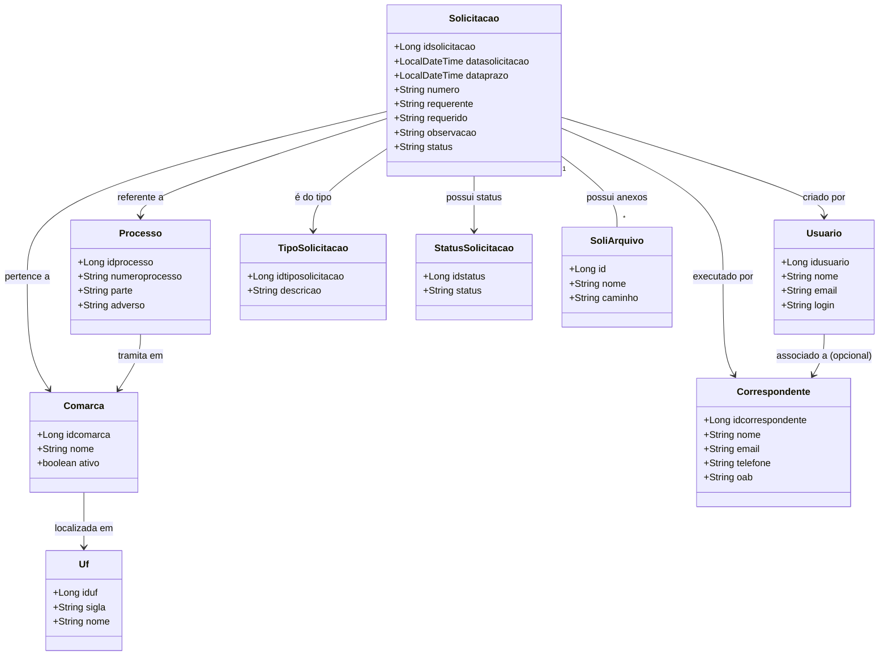
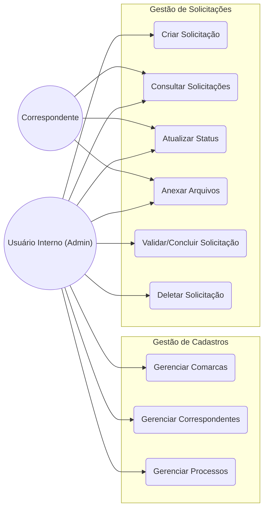
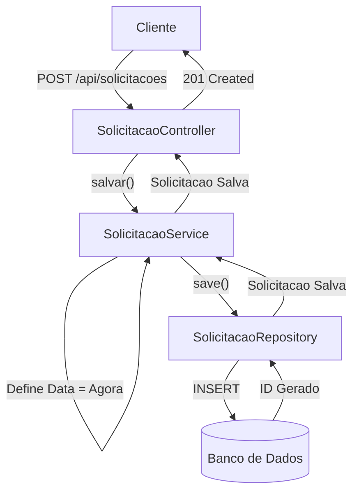
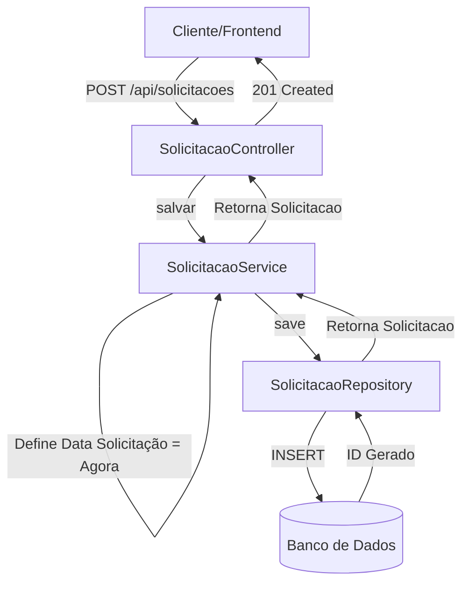
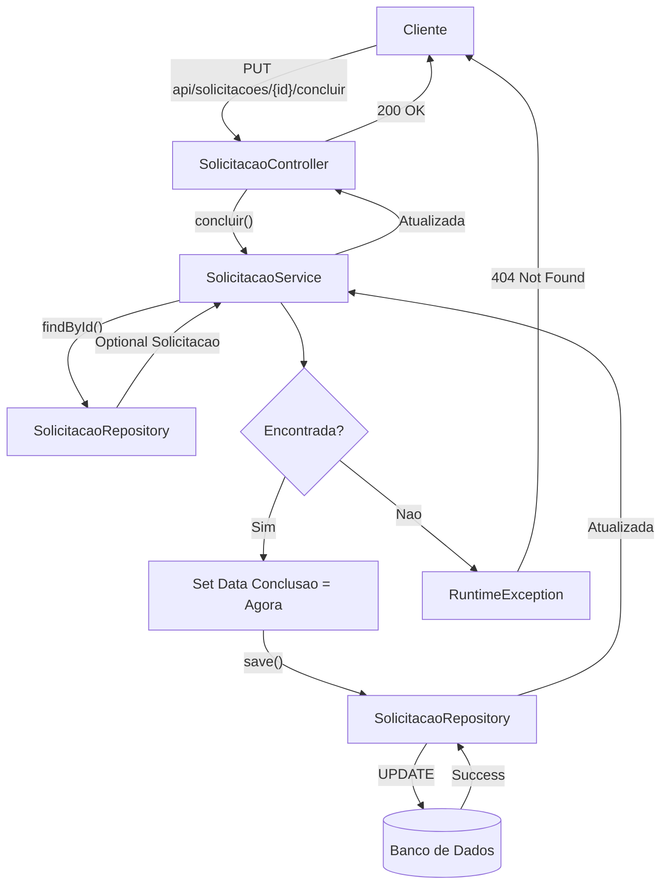
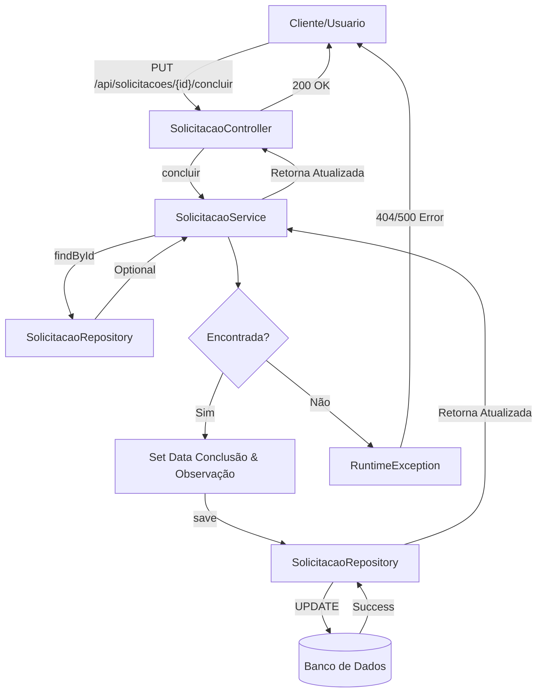
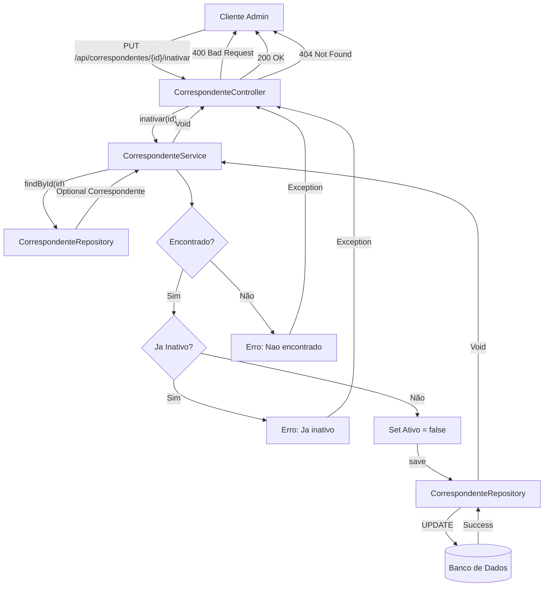
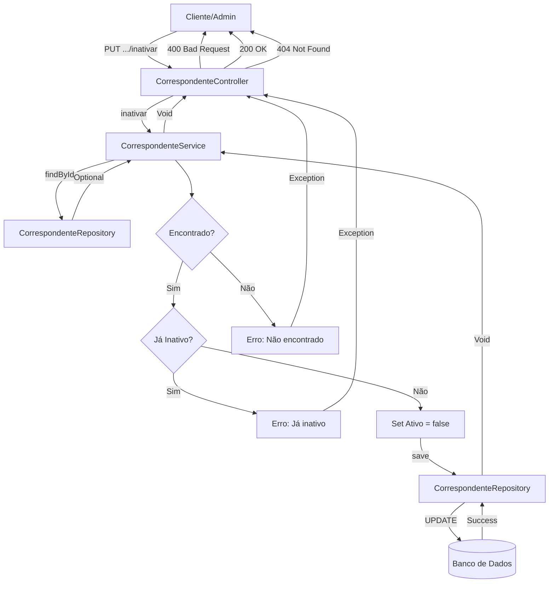
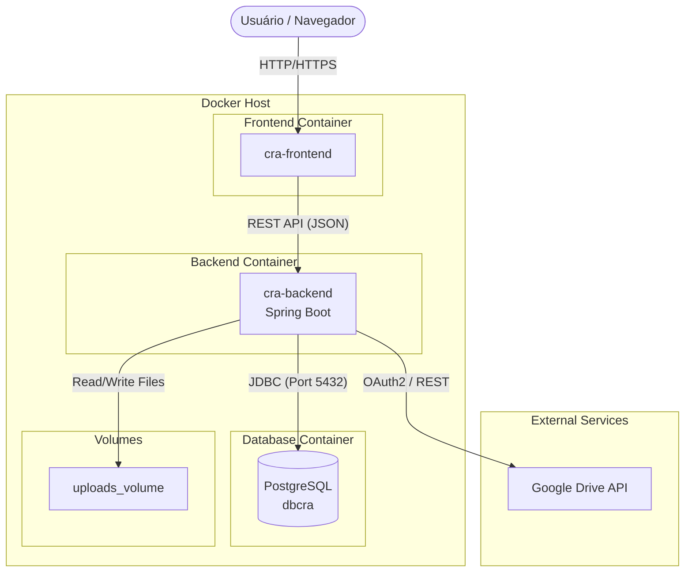

# Documentação da API - CRA Backend

## 1. Visão Geral e Arquitetura

O projeto **CRA Backend** é uma aplicação desenvolvida em **Java** utilizando o framework **Spring Boot**. A arquitetura segue o padrão de **camadas (Layered Architecture)**, separando as responsabilidades em:

*   **Controller Layer (`br.adv.cra.controller`):** Responsável por expor os endpoints da API REST, receber as requisições HTTP e retornar as respostas adequadas.
*   **Service Layer (`br.adv.cra.service`):** Contém a lógica de negócios da aplicação.
*   **Repository Layer (`br.adv.cra.repository`):** Interface com o banco de dados, utilizando **Spring Data JPA**.
*   **Entity Layer (`br.adv.cra.entity`):** Representa as tabelas do banco de dados (Modelo de Domínio).
*   **DTO Layer (`br.adv.cra.dto`):** Objetos de Transferência de Dados para desacoplar as entidades da API.

### Tecnologias Principais
*   **Java 23**
*   **Spring Boot 3.2.5**
*   **Spring Security & JWT** (Autenticação e Autorização)
*   **Spring Data JPA** (Persistência)
*   **MySQL** (Banco de Dados)
*   **Swagger / OpenAPI 3** (Documentação Interativa)
*   **Lombok** (Redução de boilerplate)
*   **JasperReports** (Geração de Relatórios/PDF)

---

## 2. Diagrama de Classes

O diagrama abaixo representa as principais entidades do sistema e seus relacionamentos. A entidade central é a `Solicitacao`, que se conecta a praticamente todas as outras entidades.

---

## 3. Diagrama de Casos de Uso

O diagrama a seguir ilustra as principais funcionalidades disponíveis para os atores do sistema (Usuário Interno/Admin e Correspondente).

---

## 4. Documentação da API (Principais Endpoints)

A API base está em `/api`. Abaixo listamos os endpoints principais do controlador de Solicitações (`/api/solicitacoes`), que é o core do sistema.

Para documentação interativa e completa, acesse o Swagger UI: `/api/swagger-ui.html`

### 4.1. Solicitações (`/api/solicitacoes`)

#### Endpoints Principais

**1. Listar Todas (Paginado)**
*   **GET** `/api/solicitacoes`
*   **Parâmetros de Query:**
    *   `page` (int): Número da página (padrão: 0).
    *   `size` (int): Itens por página (padrão: 10).
    *   `sortBy` (String): Campo para ordenação (padrão: "datasolicitacao").
    *   `direction` (String): Direção da ordenação, "ASC" ou "DESC" (padrão: "DESC").

**2. Buscar por ID**
*   **GET** `/api/solicitacoes/{id}`
*   **Parâmetros de Path:**
    *   `id` (Long): ID da solicitação.

**3. Criar Nova Solicitação**
*   **POST** `/api/solicitacoes`
*   **Corpo da Requisição (JSON):** Objeto `Solicitacao` completo. Campos obrigatórios dependem da validação da entidade (ex: `comarca`, `processo`, `requerente`).

**4. Atualizar Solicitação**
*   **PUT** `/api/solicitacoes/{id}`
*   **Parâmetros de Path:**
    *   `id` (Long): ID da solicitação a ser atualizada.
*   **Corpo da Requisição (JSON):** Objeto `Solicitacao` com os dados atualizados.

**5. Atualizar Status**
*   **PUT** `/api/solicitacoes/{id}/status/{statusId}`
*   **Parâmetros de Path:**
    *   `id` (Long): ID da solicitação.
    *   `statusId` (Long): ID do novo status.
    
**6. Concluir Solicitação**
*   **PUT** `/api/solicitacoes/{id}/concluir`
*   **Parâmetros de Path:**
    *   `id` (Long): ID da solicitação.
*   **Corpo da Requisição (JSON):** String contendo a `observacao` de conclusão (opcional).

**7. Deletar Solicitação**
*   **DELETE** `/api/solicitacoes/{id}`
*   **Parâmetros de Path:**
    *   `id` (Long): ID da solicitação a ser removida.

#### Buscas e Filtros Específicos

Todos os endpoints de listagem abaixo suportam os mesmos parâmetros de paginação (`page`, `size`, `sortBy`, `direction`).

| Método | Endpoint | Parâmetros Específicos | Descrição |
|---|---|---|---|
| **GET** | `/api/solicitacoes/pendentes` | - | Lista solicitações com status pendente. |
| **GET** | `/api/solicitacoes/concluidas` | - | Lista solicitações com status concluído. |
| **GET** | `/api/solicitacoes/atrasadas` | - | Lista solicitações onde `dataprazo` < data atual e não concluídas. |
| **GET** | `/api/solicitacoes/buscar/periodo` | `inicio`, `fim` (DateTime ISO) | Busca por intervalo de datas. |
| **GET** | `/api/solicitacoes/buscar/texto` | `texto` (String) | Busca textual em diversos campos. |
| **GET** | `/api/solicitacoes/buscar/comarca/{id}` | `id` (Long) do Path | Filtra por Comarca específica. |
| **GET** | `/api/solicitacoes/correspondente/{id}` | `id` (Long) do Path | Filtra por Correspondente específico. |
| **POST** | `/api/solicitacoes/buscar/avancado` | Body: `SolicitacaoFiltroDTO` | Busca complexa com múltiplos critérios. |

### 4.2. Autenticação (`/api/auth`)

| Método | Endpoint | Parâmetros | Descrição |
|---|---|---|---|
| **POST** | `/api/auth/login` | Body: `LoginRequest` {`username`, `password`} | Realiza login e retorna Token JWT. |
| **POST** | `/api/auth/register` | Body: `RegisterRequest` | (Admin) Registra novos usuários. |
| **POST** | `/api/auth/refresh` | Body: `RefreshTokenRequest` {`refreshToken`} | Renova o Token JWT. |
| **GET** | `/api/auth/me` | Header: `Authorization` | Retorna dados do usuário logado. |

### 4.3. Outros Recursos Detalhados

#### Comarcas (`/api/comarcas`)
Endpoints para gestão de comarcas. Suporta paginação (`page`, `size`, `sortBy`, `direction`) na listagem padrão.

| Método | Endpoint | Parâmetros | Descrição |
|---|---|---|---|
| **GET** | `/api/comarcas` | Query: `page`, `size`, ... | Lista todas as comarcas. |
| **POST** | `/api/comarcas` | Body: `Comarca` | Cria nova comarca. |
| **GET** | `/api/comarcas/{id}` | Path: `id` | Busca comarca por ID. |
| **PUT** | `/api/comarcas/{id}` | Path: `id`, Body: `Comarca` | Atualiza comarca. |
| **GET** | `/api/comarcas/buscar/nome` | Query: `nome` | Busca por nome parcial. |
| **GET** | `/api/comarcas/buscar/uf/{ufId}` | Path: `ufId` | Busca comarcas de um estado. |

#### Correspondentes (`/api/correspondentes`)
Endpoints para gestão de correspondentes.

| Método | Endpoint | Parâmetros | Descrição |
|---|---|---|---|
| **GET** | `/api/correspondentes` | - | Lista todos os correspondentes. |
| **POST** | `/api/correspondentes` | Body: `Correspondente` | Cria novo correspondente. |
| **PUT** | `/api/correspondentes/{id}` | Path: `id`, Body: `Correspondente` | Atualiza correspondente. |
| **GET** | `/api/correspondentes/buscar/nome` | Query: `nome` | Busca por nome. |
| **GET** | `/api/correspondentes/buscar/cpfcnpj/{cpfCnpj}` | Path: `cpfCnpj` | Busca por CPF ou CNPJ. |
| **GET** | `/api/correspondentes/buscar/oab/{oab}` | Path: `oab` | Busca por número da OAB. |

#### Demais Recursos
*   **Processos** (`/api/processos`): CRUD de processos.
*   **Arquivos** (`/api/soli-arquivos`): Upload (`MultipartFile`) e download de anexos.
*   **Google Drive** (`/api/google-drive`): Integração para armazenamento em nuvem.

## 5. Modelo de Dados (Entidades Principais)

### Solicitacao
Principal entidade que orquestra o fluxo de trabalho.
*   **idsolicitacao**: Identificador único.
*   **datasolicitacao**: Data de criação.
*   **dataprazo**: Prazo para cumprimento.
*   **comarca**: Associação com a Comarca onde o ato será realizado.
*   **correspondente**: Associação com quem realizará o ato.
*   **statusSolicitacao**: Estado atual (Aberto, Em Andamento, Concluído, etc.).

### Correspondente
Profissional parceiro.
*   **nome**, **email**, **telefone**.
*   **oab**: Registro profissional.
*   **enderecos**: Localização física.

### Comarca
Localidade jurídica.
*   **nome**.
*   **uf**: Estado da federação.

## 6. Diagramas de Sequência e Fluxo

### 6.1. Fluxo de Criação de Solicitação

**Opção 1: Digrama de Sequência (Padrão)**
Este diagrama detalha a interação entre as camadas.

**Opção 2: Fluxograma (Simplificado)**
Caso o diagrama acima não renderize, veja este fluxo simplificado.

### 6.2. Fluxo de Conclusão de Solicitação

**Opção 1: Digrama de Sequência (Padrão)**

**Opção 2: Fluxograma (Simplificado)**

### 6.3. Fluxo de Inativação de Correspondente

**Opção 1: Digrama de Sequência (Padrão)**

**Opção 2: Fluxograma (Simplificado)**

## 7. Diagrama de Implantação

Este diagrama ilustra a arquitetura de implantação do sistema, destacando os contêineres Docker e as integrações externas.

## 8. Considerações Finais
Esta documentação fornece uma visão geral técnica do backend do sistema CRA. Para detalhes de implementação, consulte o código-fonte e os comentários JavaDoc.
